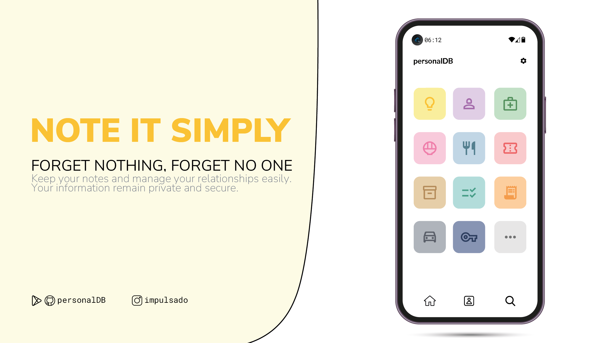
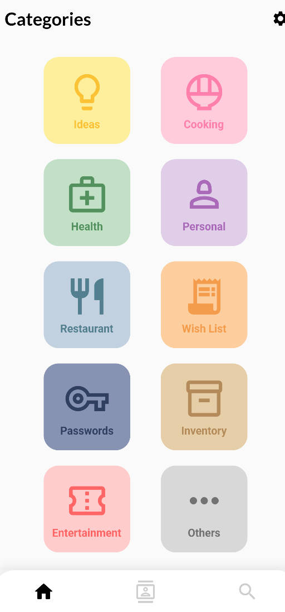
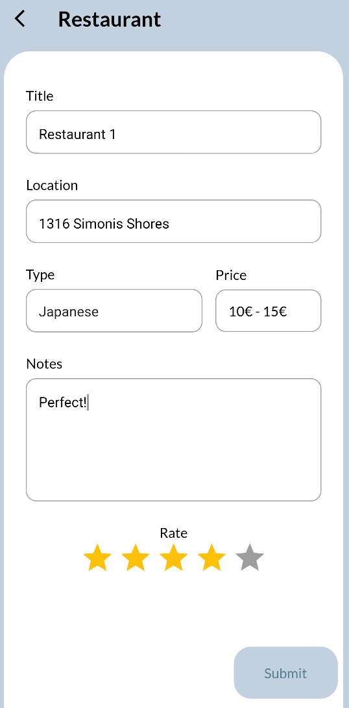
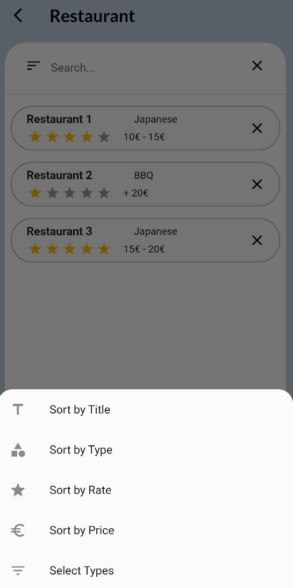
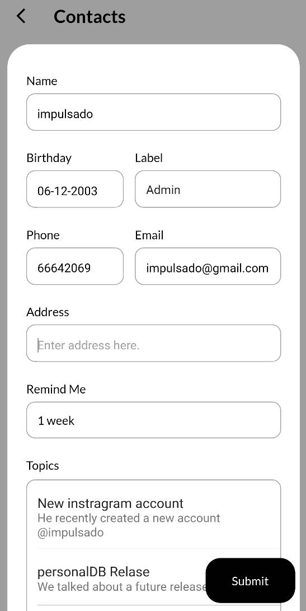
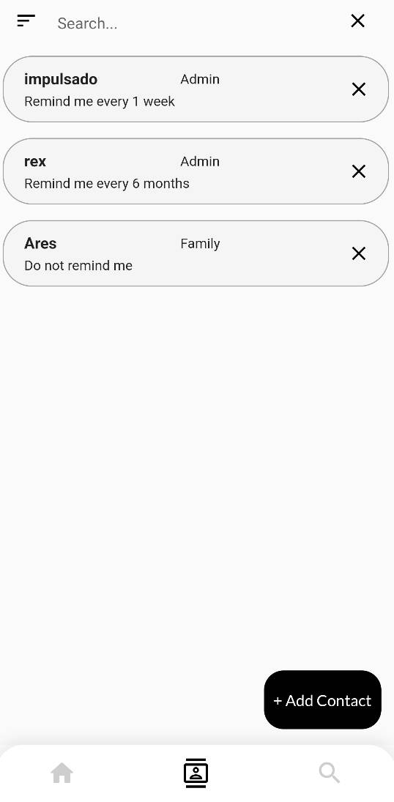
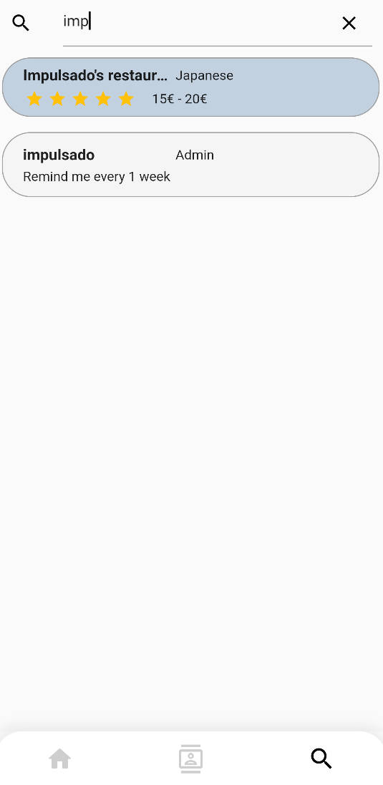

# PersonalDB

A **secure** application for storing your **personal database** on your phone, with data encryption.

  

 

## Features

- Store and protect your personal database on your phone.
- Data encryption for enhanced security.
- Intuitive and user-friendly interface.
- End-to-end encryption to safeguard your sensitive data.
- Quick search and data filtering for easy access to desired information.

 

## Screenshots

  
  
  

  
  
  

 

## Contributing
Contributions are welcome!  
If you have any ideas, suggestions, or find a bug, please open a new issue or submit a pull request.

1. Fork the project.
2. Create a new branch (**git checkout -b feature/new-feature**).
3. Make the necessary changes and commit them (**git commit -am "(ADD) New feature"**).
4. Push to the branch (**git push origin feature/new-feature**).
5. Open a pull request on GitHub.

 

## License
This project is licensed under the [Apache License, Version 2.0](https://www.apache.org/licenses/LICENSE-2.0).